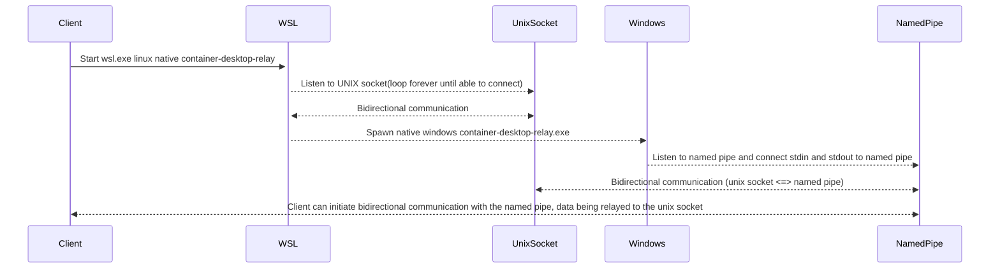

# container-desktop-wsl-relay

Relay WSL unix sockets through windows named pipes by using a relay proxy native windows program's stdin and stdout.

## Why

- Although `AF_UNIX` support exists in Windows, as of `30.09.2024`, native programs cannot use unix sockets from WSL 2, see <https://github.com/microsoft/WSL/issues/5961>. They are supported in WSL 1 though.
- Spawning TCP listeners on `localhost` would be easy, but it is not secure as any users logged-in to the machine can listen to them. In some environments, this might not be acceptable.
- **Personal note** - I wish this utility wouldn't exist and WSL 2 sockets can be used by native windows programs, just as WSL 1.

## Using the named pipe

Flow of communication



## Requirements

- NodeJS installed in windows and exposed to `%PATH%` (needed to test the relay named pipe connection)
- WSL with default distribution(Ubuntu)
- Build dependencies

In the default WSL distribution(Ubuntu), where the repo is cloned and where tests are made, golang and windows cross-compilation and optimization tools are needed.

```bash
sudo apt-get install build-essential gcc-mingw-w64 musl-tools golang upx-ucl
```

## Building

- Static binaries are generated to make the relay available on as many linux distributions as possible, besides the default WSL distribution(Ubuntu)
- UPX is used to reduce the size of the binaries, that are usually embedded into other programs

```bash
./relay-build.sh
```

## Testing

- Inside the cloned directory, execute the next script from `wsl.exe` terminal console - **IMPORTANT - Not windows powershell or cmd!**
- Must use `node.exe` because `relay-test.js` will need to connect to a named pipe, only Windows has named pipes, hence `node.exe`, not `node`!

```bash
./relay-build.sh
./relay-start.sh
```

From a powershell console

```powershell
npm install
node.exe relay-test.js
```

## Permissions

- **AllowEveryone** = `"S:(ML;;NW;;;LW)D:(A;;0x12019f;;;WD)"` - _AllowEveryone - **to be avoided**, allows any users running on current machine._
- **AllowCurrentUser** = `"D:P(A;;GA;;;$SID)"` - _AllowCurrentUser grants full access permissions for the current user. The variable `$SID` is interpolated at runtime._
- **AllowServiceSystemAdmin** = `"D:(A;ID;FA;;;SY)(A;ID;FA;;;BA)(A;ID;FA;;;LA)(A;ID;FA;;;LS)"` - _AllowServiceSystemAdmin grants full access permissions for Service, System, Administrator group and account._
- If the permission don't match the strings above, any ACL expression can be used.

## Usage

From a WSL terminal bash console

```bash
RELAY_SOCKET=$(docker context inspect --format json | jq -e ".[0].Endpoints.docker.Host | sub(\"unix://\"; \"\")" | tr -d '"')
RELAY_PIPE="\\\\.\\pipe\\container-desktop-test"
RELAY_PROGRAM="$PROJECT_HOME/bin/container-desktop-wsl-relay"

./bin/container-desktop-wsl-relay.exe --distribution="$WSL_DISTRO_NAME" --named-pipe="$RELAY_PIPE" --unix-socket="$RELAY_SOCKET" -relay-program-path="$RELAY_PROGRAM"
```

Test using a NodeJS `child_process` started by the **Windows** native `node.exe` interpreter. This can be executed from any shell.

```shell
node.exe relay-test.js
```

## Notes

- The spawned Windows native `container-desktop-wsl-relay.exe` is checking every `2` seconds if the parent process that spawned it has died, in such case it exits.
