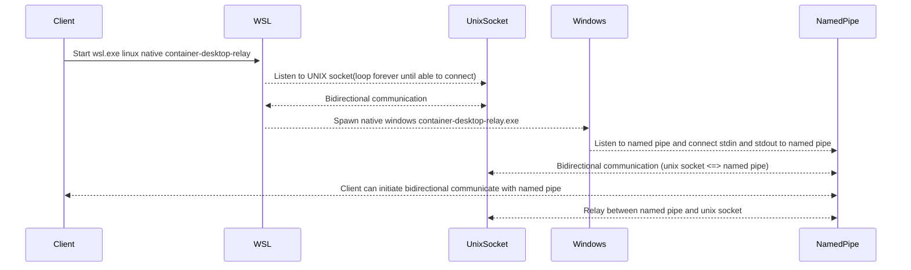

# container-desktop-wsl-relay

Relay WSL unix sockets through windows named pipes by using a relay proxy native windows program.

## Why

- Although `AF_UNIX` support exists in Window, Windows native programs cannot use unix sockets from WSL 2.
- Spawning TCP listeners on `localhost` would be easy, but it is not secure as any users logged-in to the machine can listen to them. In some environments, this might not be acceptable.

## Using the named pipe

Flow of communication



## Requirements

- NodeJS installed in windows and exposed to `%PATH%` (needed to test the relay named pipe connection)
- WSL with default distribution(Ubuntu)
- Build dependencies

In the default WSL distribution(Ubuntu), where the repo is cloned and where tests are made, golang and windows cross-compilation and optimization tools are needed.

```bash
sudo apt-get install build-essential gcc-mingw-w64 musl-tools golang upx-ucl
```

## Building

- Static binaries are generated to make the relay available on as many linux distributions as possible, besides the default WSL distribution(Ubuntu)
- UPX is used to reduce the size of the binaries, that are usually embedded into other programs

```bash
./relay-build.sh
```

## Testing

- Inside the cloned directory, execute the next script from `wsl.exe` terminal console - **IMPORTANT - Not windows powershell or cmd!**
- Must use `node.exe` because `relay-test.js` will need to connect to a named pipe, only Windows has named pipes, hence `node.exe`, not `node`!

```bash
./relay-build.sh
npm install
node.exe relay-test.js
```

## Permissions

- **AllowEveryone** = `"S:(ML;;NW;;;LW)D:(A;;0x12019f;;;WD)"` - _AllowEveryone - **to be avoided**, allows any users running on current machine._
- **AllowCurrentUser** = `"D:P(A;;GA;;;$SID)"` - _AllowCurrentUser grants full access permissions for the current user. The variable `$SID` is interpolated at runtime._
- **AllowServiceSystemAdmin** = `"D:(A;ID;FA;;;SY)(A;ID;FA;;;BA)(A;ID;FA;;;LA)(A;ID;FA;;;LS)"` - _AllowServiceSystemAdmin grants full access permissions for Service, System, Administrator group and account._

## Usage

From a WSL terminal console

```shell
export RELAY_SOCKET="/var/run/docker.sock"
export RELAY_PIPE="\\\\.pipe\\container-desktop-relay-docker"
./container-desktop-wsl-relay --socket "$RELAY_SOCKET" --pipe "$RELAY_PIPE" --relay-program-path "$PROJECT_HOME/container-desktop-wsl-relay.exe"
```

Using a node-js child_process started from Windows

```shell
node.exe relay-test.js
```

## Pitfalls

As of version `1.0.1` I am unable to ensure that the spawned windows native executable dies when parent WSL linux native spawner gets killed or exits, I am looking for options.
